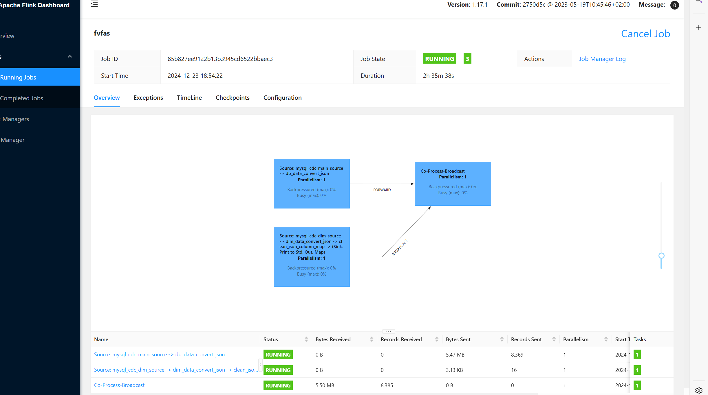

FlinkDimApp项目代码优化,yarn提交部署成功!

遇到的问题:

1)hbase创建表的时候,列族不用添加,直接运用JSONObject的本身特性就可以!
2)Mysql本地 base_region表需添加主键,不然Sink不进去数据!

Java的设计模式:

1单例模式:意图：确保一个类只有一个实例，并提供一个全局访问点来访问这个实例。
实现方式：通常将类的构造函数设为私有，通过一个静态方法来获取唯一的实例。

2:工厂模式:意图：将对象的创建和使用分离，通过一个工厂类来负责创建对象。这样可以根据不同的条件或参数创建不同类型的对象。

3:抽象工厂模式:意图：提供一个创建一系列相关或相互依赖对象的接口，而无需指定它们具体的类。

4:结构型模式:意图：为其他对象提供一种代理以控制对这个对象的访问。代理对象可以在原对象的基础上添加额外的功能，如权限控制、懒加载等

5:桥接模式（Bridge Pattern）
意图：将抽象部分与它的实现部分分离，使它们可以独立地变化。

6:行为型模式
观察者模式（Observer Pattern）
意图：定义了一种一对多的依赖关系，让多个观察者对象同时监听某一个主题对象。当主题对象的状态发生变化时，会通知所有观察者对象，使它们能够自动更新自己

7:策略模式（Strategy Pattern）
意图：定义一系列的算法，把它们一个个封装起来，并且使它们可以相互替换。本模式使得算法的变化独立于使用它的客户。

8:模板方法模式（Template Method Pattern）
意图：定义一个操作中的算法的骨架，而将一些步骤延迟到子类中。模板方法使得子类可以不改变一个算法的结构即可重定义该算法的某些特定步骤。

##ProcessSpiltStreamToHBaseDim 类中各个方法的详细解释：##
1. 类的整体结构与作用
   ProcessSpiltStreamToHBaseDim 类继承自 BroadcastProcessFunction<JSONObject, JSONObject, JSONObject>，这表明它是在 Flink 流处理框架中用于处理广播流和常规数据流交互的一个函数类。它的主要作用是从 MySQL 中获取配置数据（存储在 TableProcessDim 类型的数据结构中），并基于这些配置以及接收到的数据流中的信息，将数据写入到 HBase 中，同时处理广播流传来的配置更新信息。
2. 成员变量
   java
   private MapStateDescriptor<String, JSONObject> mapStateDescriptor;
   private HashMap<String, TableProcessDim> configMap =  new HashMap<>();
   private org.apache.hadoop.hbase.client.Connection hbaseConnection ;
   private HbaseUtils hbaseUtils;
   mapStateDescriptor：用于定义广播状态的描述符，指定了广播状态中键为 String 类型、值为 JSONObject 类型的数据结构信息，方便 Flink 在内部对广播状态进行管理和序列化 / 反序列化操作。
   configMap：一个 HashMap，用于存储从 MySQL 数据库查询出来的配置信息，键是表名（具体业务相关的表名，比如 spu_info 等），值是对应的 TableProcessDim 类型对象，该对象包含了如源表名、目标 HBase 表名、列族、行键等配置详情，方便后续根据数据流中的表名快速获取相应配置来处理数据。
   hbaseConnection：代表与 HBase 的连接对象，通过 HbaseUtils 获取，后续用于与 HBase 进行交互，比如执行数据的插入操作等。
   hbaseUtils：是一个自定义的工具类实例（HbaseUtils 类应该提供了创建 HBase 连接等相关功能），用于创建和管理与 HBase 的连接以及可能的其他 HBase 相关操作辅助功能。
3. open 方法
   java
   @Override
   public void open(Configuration parameters) throws Exception {
   Connection connection = JdbcUtils.getMySQLConnection(
   ConfigUtils.getString("mysql.url"),
   ConfigUtils.getString("mysql.user"),
   ConfigUtils.getString("mysql.pwd"));
   String querySQL = "select * from gmall2024_config.table_process_dim";
   List<TableProcessDim> tableProcessDims = JdbcUtils.queryList(connection, querySQL, TableProcessDim.class, true);
   // configMap:spu_info -> TableProcessDim(sourceTable=spu_info, sinkTable=dim_spu_info, sinkColumns=id,spu_name,description,category3_id,tm_id, sinkFamily=info, sinkRowKey=id, op=null)
   for (TableProcessDim tableProcessDim : tableProcessDims ){
   configMap.put(tableProcessDim.getSourceTable(),tableProcessDim);
   }
   connection.close();
   hbaseUtils = new HbaseUtils(ConfigUtils.getString("zookeeper.server.host.list"));
   hbaseConnection = hbaseUtils.getConnection();
   }
   初始化操作概述：该方法是在 Flink 算子初始化时被调用，主要执行一些初始化资源和获取必要数据的操作，为后续的数据处理流程做准备。
   具体步骤：
   获取 MySQL 连接并查询配置数据：
   首先通过 JdbcUtils 工具类（应该是自定义的用于操作 MySQL 数据库连接和查询的类），利用 ConfigUtils.getString（同样是自定义的配置获取工具方法，用于从配置文件或配置中心获取相应配置项的值）获取的 MySQL 连接相关配置（如连接地址、用户名、密码）来建立与 MySQL 数据库的连接。
   然后执行一条查询语句 select * from gmall2024_config.table_process_dim，通过 JdbcUtils.queryList 方法（按指定的 TableProcessDim 类型进行结果映射）查询出所有符合条件的配置数据，返回一个 TableProcessDim 类型的列表。
   存储配置数据到 configMap：遍历查询出来的 TableProcessDim 列表，将每个 TableProcessDim 对象以其 sourceTable 字段的值作为键，整个对象作为值，存入 configMap 这个 HashMap 中，方便后续根据表名快速查找对应的配置信息。
   关闭 MySQL 连接并建立 HBase 连接：在完成对 MySQL 数据的读取后，关闭之前建立的 MySQL 连接，释放相关资源。接着通过 HbaseUtils 工具类（使用从 ConfigUtils.getString("zookeeper.server.host.list") 获取的 Zookeeper 服务器地址列表信息）创建与 HBase 的连接，并将获取到的连接对象赋值给 hbaseConnection，以便后续与 HBase 进行交互操作。
4. processElement 方法
   java
   @Override
   public void processElement(JSONObject jsonObject, BroadcastProcessFunction<JSONObject, JSONObject, JSONObject>.ReadOnlyContext readOnlyContext, Collector<JSONObject> collector) throws Exception {
   //{"op":"c","after":{"is_ordered":0,"cart_price":"Ceqs","sku_num":1,"create_time":1734821068000,"user_id":"1150","sku_id":3,"sku_name":"小米12S Ultra 骁龙8+旗舰处理器 徕卡光学镜头 2K超视感屏 120Hz高刷 67W快充 12GB+256GB 经典黑 5G手机","id":20224},"source":{"thread":123678,"server_id":1,"version":"1.9.7.Final","file":"mysql-bin.000002","connector":"mysql","pos":383682973,"name":"mysql_binlog_source","row":0,"ts_ms":1734741512000,"snapshot":"false","db":"realtime_v1","table":"cart_info"},"ts_ms":1734741512593}
   //        System.err.println("processElement process -> "+jsonObject.toString());
   //org.apache.flink.streaming.api.operators.co.CoBroadcastWithNonKeyedOperator$ReadOnlyContextImpl@52b20462
   ReadOnlyBroadcastState<String, JSONObject> broadcastState = readOnlyContext.getBroadcastState(mapStateDescriptor);
   String tableName = jsonObject.getJSONObject("source").getString("table");
   JSONObject broadData = broadcastState.get(tableName);
   // 这里可能为null NullPointerException
   if (broadData!= null || configMap.get(tableName)!= null){
   if (configMap.get(tableName).getSourceTable().equals(tableName)){
   //                System.err.println(jsonObject);
   if (!jsonObject.getString("op").equals("d")){
   JSONObject after = jsonObject.getJSONObject("af ter");
   String sinkTableName = configMap.get(tableName).getSinkTable();
   sinkTableName = "gmall:"+sinkTableName;
   String hbaseRowKey = after.getString(configMap.get(tableName).getSinkRowKey());
   Table hbaseConnectionTable = hbaseConnection.getTable(TableName.valueOf(sinkTableName));
   Put put = new Put(Bytes.toBytes(hbaseRowKey));
   for (Map.Entry<String, Object> entry : after.entrySet()) {
   put.addColumn(Bytes.toBytes("info"),Bytes.toBytes(entry.getKey()),Bytes.toBytes(String.valueOf(entry.getValue())));
   }
   hbaseConnectionTable.put(put);
   System.err.println("put -> "+put.toJSON()+" "+ Arrays.toString(put.getRow()));
   }
   }
   }
   }
   处理常规数据流元素：该方法会针对每一个流入的常规数据流中的元素（这里是 JSONObject 类型的数据）进行处理，根据配置信息决定是否将数据写入到 HBase 中。
   具体处理步骤：
   获取广播状态和表名信息：首先从传入的 ReadOnlyContext 中通过 mapStateDescriptor 获取广播状态对象 ReadOnlyBroadcastState，然后从输入的 jsonObject 中解析出当前数据所属的表名（从 jsonObject 的 source 字段下的 table 子字段获取），接着尝试从广播状态中获取对应表名的广播数据（broadData）。
   条件判断与数据处理决策：
   进行条件判断，如果广播数据不为 null 或者从 configMap 中能根据表名获取到对应的配置信息（即 configMap.get(tableName)!= null），就进一步检查配置信息中的源表名是否与当前解析出的表名一致（通过 configMap.get(tableName).getSourceTable().equals(tableName) 判断），这一步是为了确保配置和实际数据的表名匹配。
   若表名匹配且当前数据的操作类型（从 jsonObject 中获取的 op 字段）不是删除操作（"d"），则进行数据写入 HBase 的操作。
   构建并执行 HBase 写入操作：
   从 jsonObject 的 after 字段获取具体要写入的数据内容（也是一个 JSONObject），然后根据配置信息获取目标 HBase 表名（添加了 "gmall:" 前缀，可能是用于区分命名空间之类的业务需求）、行键（通过配置中指定的行键字段从 after 数据中获取对应的值）等信息。
   通过 hbaseConnection 获取对应的 HBase 表对象，创建一个 Put 对象用于表示要插入的数据操作，将行键转换为字节数组传入 Put 的构造函数进行初始化。
   接着遍历要写入的数据（after 中的键值对），将列名和值都转换为字节数组后，通过 Put 对象的 addColumn 方法添加到 Put 操作中，构建完整的写入操作对象。
   最后通过获取到的 HBase 表对象的 put 方法，将构建好的 Put 对象插入到 HBase 表中，完成数据写入操作，并打印一些相关的日志信息（如插入的 Put 对象的 JSON 表示以及行键的字节数组形式等，方便调试和查看操作情况）。
5. processBroadcastElement 方法
   java
   @Override
   public void processBroadcastElement(JSONObject jsonObject, BroadcastProcessFunction<JSONObject, JSONObject, JSONObject>.Context context, Collector<JSONObject> collector) throws Exception {
   // {"op":"r","after":{"sink_row_key":"id","sink_family":"info","sink_table":"dim_base_category2","source_table":"base_category2","sink_columns":"id,name,category1_id"}}
   //        System.err.println("processBroadcastElement jsonObject -> "+ jsonObject.toString());
   BroadcastState<String, JSONObject> broadcastState = context.getBroadcastState(mapStateDescriptor);
   // HeapBroadcastState{stateMetaInfo=RegisteredBroadcastBackendStateMetaInfo{name='mapStageDesc', keySerializer=org.apache.flink.api.common.typeutils.base.StringSerializer@39529185, valueSerializer=org.apache.flink.api.java.typeutils.runtime.kryo.KryoSerializer@59b0797e, assignmentMode=BROADCAST}, backingMap={}, internalMapCopySerializer=org.apache.flink.api.common.typeutils.base.MapSerializer@4ab01899}
   String op = jsonObject.getString("op");
   if (jsonObject.containsKey("after")){
   String sourceTableName = jsonObject.getJSONObject("after").getString("source_table");
   if ("d".equals(op)){
   broadcastState.remove(sourceTableName);
   }else {
   broadcastState.put(sourceTableName,jsonObject);
   //                configMap.put(sourceTableName,jsonObject.toJavaObject(TableProcessDim.class));
   }
   }
   }
   处理广播流元素：该方法用于处理广播流中的元素，主要根据广播流传来的数据对广播状态以及本地的配置信息（configMap，虽然代码中此处对 configMap 的更新被注释掉了，但可以看出有这样的意图）进行更新操作。
   具体操作步骤：
   获取广播状态并解析操作类型和表名信息：首先从传入的 Context 中通过 mapStateDescriptor 获取广播状态对象 BroadcastState，然后从广播流传来的 jsonObject 中获取操作类型（op 字段），接着判断 jsonObject 是否包含 after 字段（这里应该是包含了一些更新相关的详细配置信息的 JSON 结构），如果包含则进一步从中获取源表名（sourceTableName）。
   根据操作类型执行相应广播状态更新操作：
   如果操作类型是删除操作（"d"），则从广播状态中移除对应源表名的记录，这意味着如果后续有基于该表名相关的数据处理，将不再参考之前广播的旧配置信息。
   如果操作类型不是删除操作，就将当前的 jsonObject（包含了更新后的配置等信息）存入广播状态中，这样后续常规数据流处理时就能获取到最新的配置情况。同时，代码中原本还有将 jsonObject 转换为 TableProcessDim 类型并更新到 configMap 的意图（虽然当前被注释掉了，但如果需要保持本地 configMap 和广播状态数据的一致性，可能需要根据实际情况决定是否启用这部分逻辑），以便在 processElement 等方法中也能基于最新的本地配置信息进行数据处理决策。
6. close 方法
   java
   @Override
   public void close() throws Exception {
   super.close();
   hbaseConnection.close();
   }
   资源清理操作：该方法在 Flink 算子关闭时被调用，主要用于释放之前占用的资源，避免资源泄漏等问题。
   具体操作：首先调用父类的 close 方法（执行一些父类中定义的通用关闭逻辑，虽然这里没明确看到父类的具体实现，但遵循继承体系的规范进行调用），然后关闭之前建立的与 HBase 的连接 hbaseConnection，确保 HBase 相关资源被正确释放，例如关闭网络连接、释放相关的内存等资源。